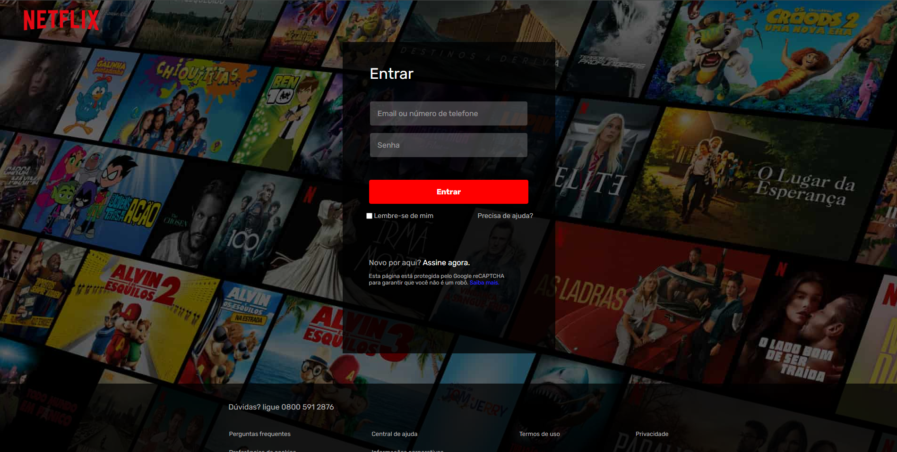

## Visão Geral

### O projeto

- Criar um clone da página de login da Netflix

### Screenshot

### Links

- Live Site URL: [Clone Login Netflix](https://joaometzdorf.github.io/clone-login-netflix/)

## Meu processo

### Criado com

- HTML
- CSS

### O que eu aprendi

- Estilização com CSS

## Autor

- GitHub - [João Metzdorf](https://github.com/joaometzdorf)
